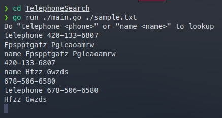

# TelephoneSearch

> Write a telephone lookup program, Telephone.java. Read the data set of 1,000 names and telephone numbers from the attached file. It contains the numbers in random order. Handle lookups by name and also reverse lookups by phone number. Use Comparator and a binary search for both lookups.



How to run:

```
chmod +x ./telephonesearch
./telephonesearch
```
